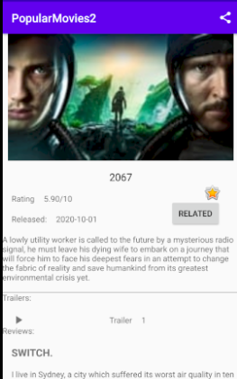

# PopularMovies2

Connects to themoviedb api and retrieves movies shown in a grid recyclerview using GridLayoutManager as the manager for the RecyclerView. 
User can select a movie and see details, trailers and reviews about a movie. The RecyclerView can be sorted by most popular movie by using the overflow menu. User 
can also select a movie and look at related movies and save their favorite movies. These favorite movies can also be deleted.
In order to use this api you'll need to register for an api key. Head over to themoviedb to register for 
one https://developers.themoviedb.org/3/getting-started/introduction Once you've done that go to the Constants in this app and add your key 
in the String api_key variable it has a value of YOUR_API_KEY_GOES_HERE. Change the value to your api_key.

## Libraries
- Picasso
- Retrofit 2
- HTTP Logging Interceptor
- ViewModel
- Lifecycle
- RecyclerView

 |
 |
 

